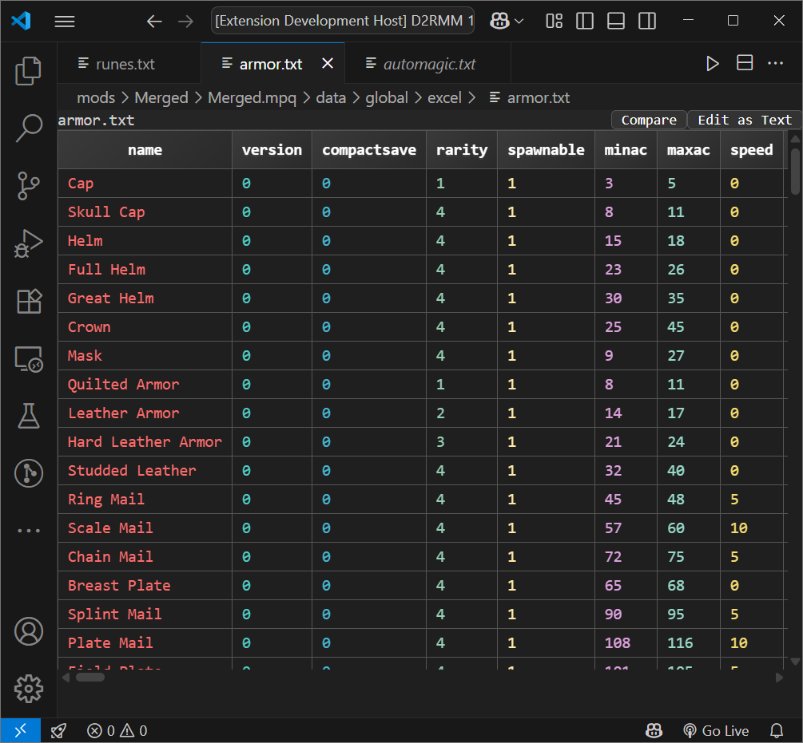

# Diablo II .txt Editor

[](https://marketplace.visualstudio.com/items?itemName=bethington.vscode-d2-txt-editor-extension)
[](https://marketplace.visualstudio.com/items?itemName=bethington.vscode-d2-txt-editor-extension)
[](https://marketplace.visualstudio.com/items?itemName=bethington.vscode-d2-txt-editor-extension)

A powerful VS Code extension that transforms Diablo II's tab-delimited .txt game data files into an interactive, spreadsheet-like editing experience. Perfect for modders, game developers, and anyone working with Diablo II data files.

## 🚀 Features

### Core Functionality

- **📊 Interactive Table View** - View and edit Diablo II data files in a beautiful spreadsheet interface
- **🎨 Rainbow Column Colors** - Each column has a distinct color for easy visual tracking across rows
- **✏️ In-Place Editing** - Double-click any cell to edit directly, or press Enter on selected cells
- **⌨️ Full Keyboard Navigation** - Arrow keys, Tab/Shift+Tab, Enter, and Escape for efficient editing
- **📋 Smart Copy/Paste** - Select and copy ranges of cells with proper tab-delimited formatting

### Advanced Features

- **🔍 Find & Replace** - Built-in search with highlighting (`Ctrl/Cmd + F`)
- **📑 Sticky Headers** - Column headers stay visible while scrolling
- **🔄 Column Sorting** - Click headers to sort data ascending/descending
- **➕ Add/Remove Columns** - Right-click context menu for column management
- **🎯 Multi-Selection** - Click and drag or Shift+click to select cell ranges
- **🌙 Theme Support** - Automatically adapts to VS Code's light/dark themes

### File Support

Supports all Diablo II data files including:

- `weapons.txt`, `armor.txt`, `misc.txt`
- `skills.txt`, `missiles.txt`, `monstats.txt`
- `uniqueitems.txt`, `setitems.txt`, `runes.txt`
- And 60+ other Diablo II data files

## 📸 Screenshots

| Dark Theme |
|------------|
|  |

## 🛠️ Installation

1. Open VS Code
2. Press `Ctrl+Shift+X` (Windows/Linux) or `Cmd+Shift+X` (macOS) to open Extensions
3. Search for "Diablo II .txt Editor"
4. Click Install

## 📖 Usage

### Getting Started

1. Open any Diablo II .txt file in VS Code
2. The extension automatically opens supported files in table view
3. Start editing immediately!

### Keyboard Shortcuts

| Action | Shortcut |
|--------|----------|
| Edit cell | `Enter` or double-click |
| Navigate cells | `Arrow keys` |
| Next/Previous cell | `Tab` / `Shift+Tab` |
| Save | `Ctrl/Cmd+S` |
| Find | `Ctrl/Cmd+F` |
| Select all | `Ctrl/Cmd+A` |
| Copy selection | `Ctrl/Cmd+C` |
| Switch to text editor | `Alt+E` |

### Context Menu Options

Right-click on any cell to:

- Add column (left/right)
- Delete column
- Add row (above/below)
- Delete row
- Sort column (A-Z / Z-A)

## ⚙️ Configuration

The extension can be configured through VS Code settings:

```json
{
  "tsv.enabled": true,
  "tsv.treatFirstRowAsHeader": true,
  "tsv.addSerialIndex": false,
  "tsv.fontFamily": "",
  "tsv.cellPadding": 4
}
```

### Settings Reference

| Setting | Type | Default | Description |
|---------|------|---------|-------------|
| `tsv.enabled` | boolean | `true` | Enable/disable the extension |
| `tsv.treatFirstRowAsHeader` | boolean | `true` | Treat first row as headers |
| `tsv.addSerialIndex` | boolean | `false` | Show row numbers |
| `tsv.fontFamily` | string | `""` | Custom font (inherits editor font if empty) |
| `tsv.cellPadding` | number | `4` | Cell padding in pixels |

## 🔧 Commands

Access these commands via Command Palette (`Ctrl/Cmd+Shift+P`):

- `TSV: Toggle Extension On/Off`
- `TSV: Toggle First Row as Header`
- `TSV: Toggle Serial Index Column`
- `TSV: Change Font Family`
- `TSV: Open as Raw Text`
- `TSV: Open as Table`

## 🎯 Requirements

- VS Code 1.70.0 or higher
- Node.js 14+ (for development)

## 🐛 Known Issues

- Very large files (>10MB) may experience slower performance
- Some special characters in file names may not display correctly in the toolbar

## 📝 Release Notes

### 1.1.3 (Latest)

- ✨ Added rainbow color scheme for columns
- 🎨 Improved button styling and padding
- 🔧 Enhanced keyboard shortcuts (Alt+E for text editor)
- 🚀 Removed generic TSV support, focused on Diablo II files

### 1.1.2

- 🐛 Fixed font family configuration
- 📊 Improved table rendering performance

### 1.1.0

- ✨ Added column sorting functionality
- 🎨 Font selection dropdown with VS Code integration
- 📄 Support for empty file creation and editing
- ⚡ Chunked loading for large files (1000+ rows)
- 🔧 Enhanced Ctrl/Cmd+A select-all functionality

[View full changelog](CHANGELOG.md)

## 🤝 Contributing

Contributions are welcome! Please see our [Contributing Guide](CONTRIBUTING.md) for details.

### Development Setup

```bash
# Clone the repository
git clone https://github.com/bethington/vscode-d2-txt-editor-extension.git
cd vscode-d2-txt-editor-extension

# Install dependencies
npm install

# Run tests
npm test

# Compile and watch for changes
npm run watch

# Package extension
npm run package
```

## 📜 License

This project is licensed under the [MIT License](LICENSE).

## 🙏 Acknowledgments

- Built with [Papa Parse](https://www.papaparse.com/) for robust CSV parsing
- Inspired by the Diablo II modding community
- Thanks to all contributors and users who provided feedback

## 📞 Support

- 🐛 [Report Issues](https://github.com/bethington/vscode-d2-txt-editor-extension/issues)
- 💡 [Feature Requests](https://github.com/bethington/vscode-d2-txt-editor-extension/issues/new?template=feature_request.md)
- 📧 [Contact](mailto:your-email@example.com)

---

Enjoy modding Diablo II! 🎮⚔️
