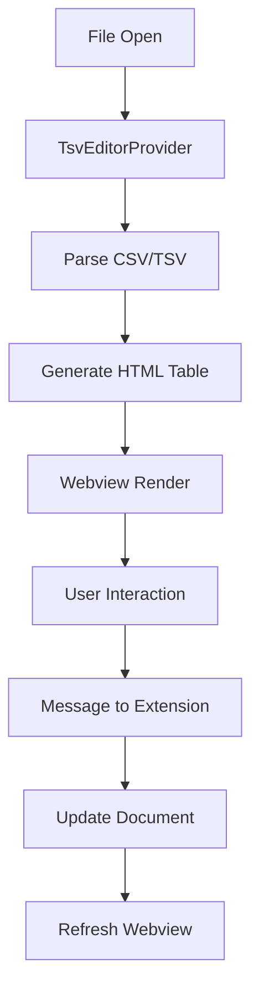

# Development Guide

This guide provides detailed information for developers contributing to the Diablo II .txt Editor extension.

## Table of Contents

- [Project Structure](#project-structure)
- [Development Setup](#development-setup)
- [Architecture Overview](#architecture-overview)
- [Code Style Guidelines](#code-style-guidelines)
- [Testing Guidelines](#testing-guidelines)
- [Debugging](#debugging)
- [Performance Considerations](#performance-considerations)
- [Security Guidelines](#security-guidelines)
- [Building and Packaging](#building-and-packaging)
- [Release Process](#release-process)

## Project Structure

```text
vscode-d2-txt-editor-extension/
├── .github/                 # GitHub workflows and templates
├── .vscode/                 # VS Code configuration
│   ├── launch.json         # Debug configurations
│   ├── settings.json       # Workspace settings
│   └── tasks.json          # Build tasks
├── docs/                   # Documentation
│   ├── api.md             # API documentation
│   └── development.md     # This file
├── images/                 # Extension icons and screenshots
├── out/                   # Compiled TypeScript output
├── src/                   # Source code
│   ├── extension.ts       # Main extension file
│   ├── test/             # Test files
│   │   ├── provider-utils.test.ts
│   │   └── security.test.ts
│   └── types/            # Type definitions
│       └── font-list.d.ts
├── CHANGELOG.md           # Version history
├── CONTRIBUTING.md        # Contribution guidelines
├── LICENSE               # MIT license
├── package.json          # Extension manifest
├── README.md             # Main documentation
└── tsconfig.json         # TypeScript configuration
```

## Development Setup

### Prerequisites

- Node.js 14+ (recommended: latest LTS)
- VS Code 1.70.0+
- Git

### Initial Setup

1. **Clone the repository:**

   ```bash
   git clone https://github.com/bethington/vscode-d2-txt-editor-extension.git
   cd vscode-d2-txt-editor-extension
   ```

2. **Install dependencies:**

   ```bash
   npm install
   ```

3. **Build the extension:**

   ```bash
   npm run compile
   ```

4. **Start development mode:**

   ```bash
   npm run watch
   ```

### Development Workflow

1. **Open in VS Code:**

   ```bash
   code .
   ```

2. **Start debugging:**
   - Press `F5` to launch Extension Development Host
   - Open a Diablo II .txt file to test changes

3. **Make changes:**
   - Edit source files in `src/`
   - TypeScript compiles automatically with watch mode

4. **Test changes:**
   - Reload Extension Development Host (`Ctrl+R` or `Cmd+R`)
   - Test functionality with various Diablo II files

## Architecture Overview

### Core Components

#### TsvEditorProvider

The main class implementing `vscode.CustomTextEditorProvider`:

- **Responsibility:** Manages the custom editor lifecycle
- **Key Methods:**
  - `resolveCustomTextEditor()` - Sets up editor when file opens
  - `updateWebviewContent()` - Renders table HTML
  - `updateDocument()` - Handles cell edits
- **Location:** `src/extension.ts` (lines 186-2000+)

#### Webview Communication

Message-based communication between extension and webview:

- **Extension → Webview:** Content updates, scroll restoration
- **Webview → Extension:** Cell edits, commands, user actions
- **Security:** Strict Content Security Policy with nonces

#### Diff Mode System

Compares base game files with modded versions:

- **Base Path:** Configurable path to original Diablo II files
- **Comparison:** Cell-by-cell diff algorithm
- **Visualization:** Color-coded highlighting of changes

### Data Flow



## Code Style Guidelines

### TypeScript Style

- Use strict TypeScript configuration
- Prefer `const` over `let`, avoid `var`
- Use meaningful variable and function names
- Document public methods with JSDoc comments

```typescript
/**
 * Computes the maximum width for each column based on content.
 * @param data The parsed data array
 * @returns Array of column widths in characters
 */
private computeColumnWidths(data: string[][]): number[] {
  // Implementation
}
```

### HTML/CSS Style

- Use semantic HTML elements
- Follow accessibility best practices
- Use CSS custom properties for theming
- Minimize inline styles

### File Organization

- Keep related functionality together
- Use meaningful file and folder names
- Separate concerns (parsing, rendering, UI logic)
- Limit file size (prefer splitting large files)

## Testing Guidelines

### Test Structure

```
src/test/
├── provider-utils.test.ts    # Unit tests for utility functions
├── security.test.ts          # Security validation tests
├── integration.test.ts       # End-to-end integration tests
└── performance.test.ts       # Performance benchmarks
```

### Test Types

#### Unit Tests

Test individual functions and methods:

```typescript
describe('computeColumnWidths', () => {
  it('returns max length per column', () => {
    const data = [['a', 'bb'], ['ccc', 'd']];
    const widths = provider.computeColumnWidths(data);
    assert.deepStrictEqual(widths, [3, 2]);
  });
});
```

#### Integration Tests

Test complete workflows:

```typescript
describe('Document editing', () => {
  it('updates cell and refreshes webview', async () => {
    await provider.updateDocument(0, 0, 'new value');
    // Verify document content and webview update
  });
});
```

#### Security Tests

Validate input sanitization:

```typescript
describe('HTML escaping', () => {
  it('escapes dangerous characters', () => {
    const escaped = escapeHtml('<script>alert("xss")</script>');
    assert.strictEqual(escaped, '&lt;script&gt;alert(&quot;xss&quot;)&lt;/script&gt;');
  });
});
```

### Running Tests

```bash
# All tests
npm test

# Specific test file
npm test -- src/test/provider-utils.test.ts

# Watch mode
npm run test:watch
```

## Debugging

### VS Code Debugging

1. **Set breakpoints** in source files
2. **Press F5** to start debugging
3. **Use Debug Console** for runtime inspection

### Debug Configuration

`.vscode/launch.json`:

```json
{
  "name": "Extension",
  "type": "extensionHost",
  "request": "launch",
  "args": ["--extensionDevelopmentPath=${workspaceFolder}"],
  "outFiles": ["${workspaceFolder}/out/**/*.js"]
}
```

### Logging

Use console logging for development:

```typescript
console.log('TSV: Parsed data with', result.data.length, 'rows');
console.error('TSV: Error parsing content', error);
```

### Common Issues

- **Webview not updating:** Check message handling in webview script
- **Performance issues:** Use browser dev tools in webview
- **File not recognized:** Verify file extension in package.json

## Performance Considerations

### Virtual Scrolling

For large files (>1000 rows):

- Only render visible rows
- Use Intersection Observer for scroll detection
- Implement efficient row recycling

### Memory Management

- Clean up event listeners on disposal
- Avoid memory leaks in webview
- Use WeakMap for caching when appropriate

### Parsing Optimization

- Use streaming for very large files
- Implement progressive parsing
- Cache parsed results when possible

## Security Guidelines

### Content Security Policy

Strict CSP in webview:

```html
<meta http-equiv="Content-Security-Policy" 
      content="default-src 'none'; 
               script-src 'nonce-${nonce}'; 
               style-src 'unsafe-inline';">
```

### Input Sanitization

Always escape user input:

```typescript
private escapeHtml(text: string): string {
  return text
    .replace(/&/g, '&amp;')
    .replace(/</g, '&lt;')
    .replace(/>/g, '&gt;')
    .replace(/"/g, '&quot;')
    .replace(/'/g, '&#39;');
}
```

### File System Access

- Validate all file paths
- Use VS Code's file system API
- Never execute user-provided code

## Building and Packaging

### Development Build

```bash
npm run compile
```

### Production Build

```bash
npm run package
```

### Packaging for Distribution

```bash
# Install vsce globally
npm install -g vsce

# Package extension
vsce package
```

### Build Configuration

`tsconfig.json`:

```json
{
  "compilerOptions": {
    "target": "ES2020",
    "lib": ["ES2020"],
    "module": "commonjs",
    "outDir": "out",
    "strict": true,
    "sourceMap": true
  },
  "exclude": ["node_modules", ".vscode-test"]
}
```

## Release Process

### Version Management

1. **Update version** in package.json
2. **Update CHANGELOG.md** with new features/fixes
3. **Create git tag** with version number
4. **Build and test** thoroughly

### Publishing Steps

1. **Build extension:**

   ```bash
   npm run compile
   npm test
   ```

2. **Package extension:**

   ```bash
   vsce package
   ```

3. **Publish to marketplace:**

   ```bash
   vsce publish
   ```

4. **Create GitHub release** with changelog

### Quality Checklist

- [ ] All tests passing
- [ ] No TypeScript errors
- [ ] Documentation updated
- [ ] Version number incremented
- [ ] CHANGELOG.md updated
- [ ] Screenshots current
- [ ] Performance benchmarks acceptable
- [ ] Security review completed

### Hotfix Process

For critical issues:

1. Create hotfix branch from main
2. Fix issue with minimal changes
3. Test thoroughly
4. Increment patch version
5. Publish immediately
6. Merge back to main

## Contributing

See [CONTRIBUTING.md](../CONTRIBUTING.md) for detailed contribution guidelines including:

- Code review process
- Pull request template
- Issue reporting guidelines
- Community standards
